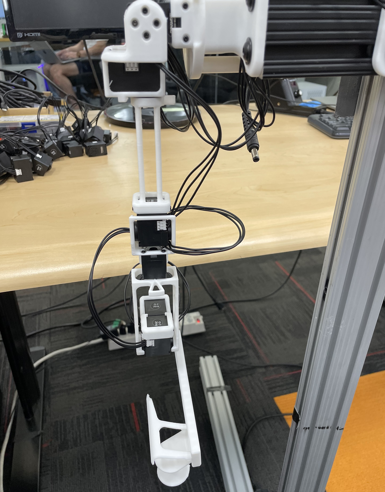
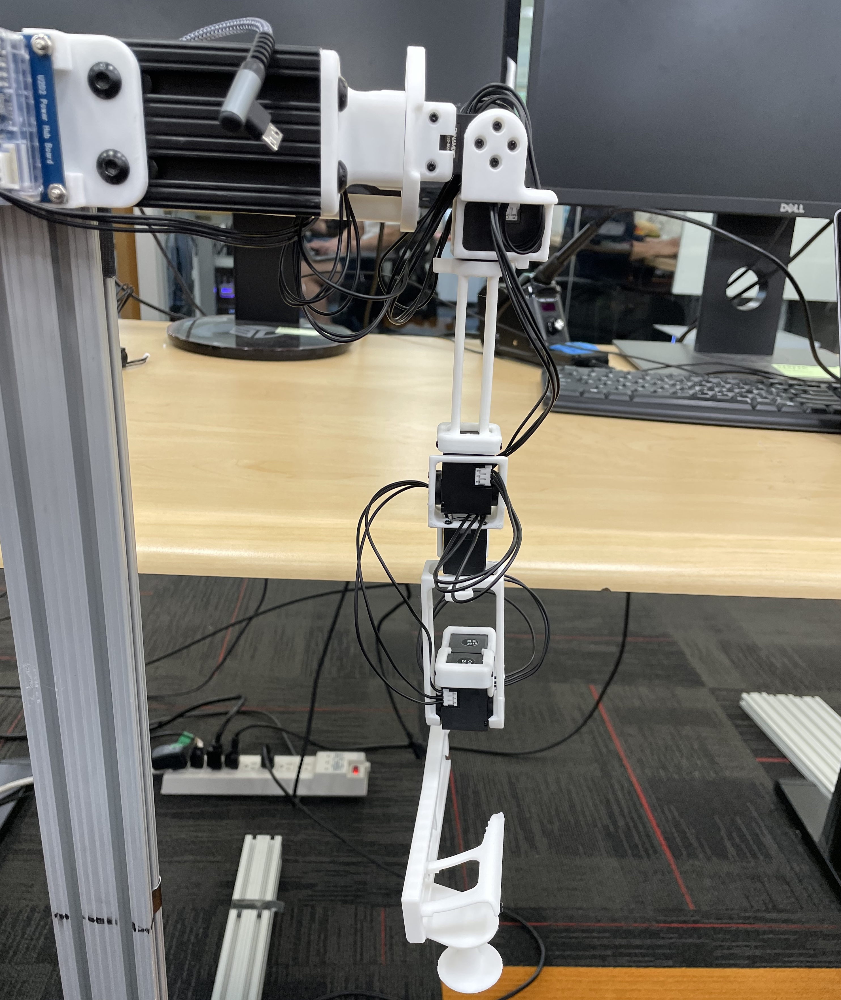
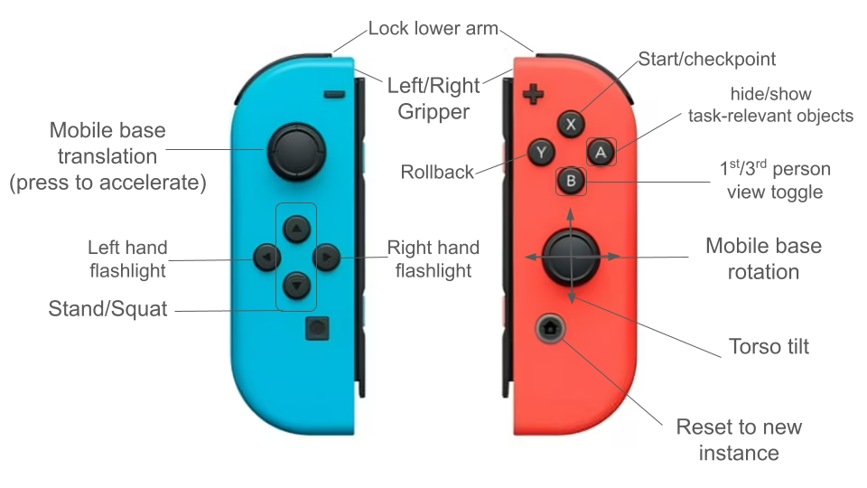
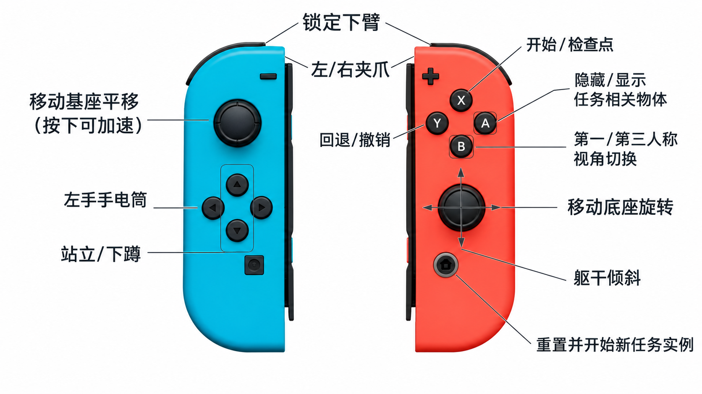

# Data Collection with JoyLo for OmniGibson

## 1. JoyLo

### 1.1 组装

参考可视化窗口中的 3d 模型进行组装:
```bash
conda create -f joylo_minimal_env.yaml
conda activate joylo-minimal

python -B scripts/joylo/view_joylo_urdf.py
```

```bash
python -B scripts/joylo/view_joylo_urdf.py \
  --robot mobile_nero \
  --without_joylo
```

### 1.2 标定

分别对单臂进行：
```bash
ARM="right"

python -B scripts/calibrate_joints.py \
  --robot R1Pro \
  --arm "${ARM}" \
  --port /dev/cu.usbserial-FTBIHTHX \
  --baudrate 2000000 \
  --gello-name "${ARM}_arm" \
  --overwrite
```

按终端提示操作：

1. 按 Enter 连接。
2. 摆成右臂零位 (joylo/imgs/R1pro\_zero\_R.jpg)，静止后按 Enter。
3. 摆成右臂标定位 (joylo/imgs/R1pro\_calibration\_R.jpg)，静止后按 Enter。

| Arm | Zero Position                                  | Calibration                                                  |
|-----|------------------------------------------------|--------------------------------------------------------------|
| left |  |  |
| right |  |  |

输出 `joylo/configs/joint_config_right_arm.yaml` 文件.

### 1.3 测试跟随

viewer 中校验检查模型跟随：

```bash
python -B scripts/joylo/view_joylo_urdf.py \
  --live-arm "${ARM}" \
  --port /dev/cu.usbserial-FTBIHTHX \
  --baudrate 2000000 \
  --joint-config "configs/joint_config_${ARM}_arm.yaml"
```

双臂都检验过后, 合并 yaml 文件为 `configs/joint_config_default.yaml`
```bash
python -B scripts/calibrate_joints.py \
  --combine_calibrate_results \
  --overwrite
```

Isaacsim 中校验检查模型跟随：
```bash
python -B joylo/scripts/run_joylo.py \
  --no_enable_joylo_torque \
  --gello-name default
```

---

## 2. JoyCon

#### Step 1: Configure udev rules

```bash
sudo nano /etc/udev/rules.d/50-nintendo-switch.rules
```

#### Step 2: Add the following content

```
# Switch Joy-con (L) (Bluetooth only)
KERNEL=="hidraw*", SUBSYSTEM=="hidraw", KERNELS=="0005:057E:2006.*", MODE="0666"

# Switch Joy-con (R) (Bluetooth only)
KERNEL=="hidraw*", SUBSYSTEM=="hidraw", KERNELS=="0005:057E:2007.*", MODE="0666"

# Switch Pro controller (USB and Bluetooth)
KERNEL=="hidraw*", SUBSYSTEM=="hidraw", ATTRS{idVendor}=="057e", ATTRS{idProduct}=="2009", MODE="0666"
KERNEL=="hidraw*", SUBSYSTEM=="hidraw", KERNELS=="0005:057E:2009.*", MODE="0666"

# Switch Joy-con charging grip (USB only)
KERNEL=="hidraw*", SUBSYSTEM=="hidraw", ATTRS{idVendor}=="057e", ATTRS{idProduct}=="200e", MODE="0666"

KERNEL=="js0", SUBSYSTEM=="input", MODE="0666"
```

#### Step 3: Refresh udev rules

```bash
sudo udevadm control --reload-rules && sudo udevadm trigger
```

#### Step 4: (Optional) Install Bluetooth manager

```bash
sudo add-apt-repository universe
sudo apt-get install blueman
```


#### Step 5: Connecting JoyCons

- Method 1: Using System Settings or Bluetooth Manager (Recommended)

1. Ensure your external Bluetooth dongle is connected
2. Open system Bluetooth settings or Bluetooth Manager
3. Search for JoyCon devices and connect when they appear

- Method 2: Using Command Line (If Method 1 fails)

```bash
bluetoothctl
scan on
# Wait for Joy-Con (L) and (R) to appear with their MAC addresses
# For each controller:
pair <MAC_ADDRESS>
trust <MAC_ADDRESS>
connect <MAC_ADDRESS>
```

> **Note:** JoyCon lights should be static (not flashing) when connected successfully.


#### Step 6: Calibrate JoyCons
```bash
python -B /scripts/calibrate_joycons.py
```

This will create two `joycon_calibration_xxx.yaml` files under `joylo/configs`.

#### Step 7: Test JoyCons in Simulation





```bash
python -B joylo/scripts/run_joylo.py --only_joycon
```

---

## 3. Collection
The system runs two scripts in separate terminals. The scripts are located under `joylo/scripts`:

| Script | Purpose | Key Args |
|--------|---------|----------|
| `launch_og.py` | Starts the OmniGibson simulation server | `--robot`, `--task_name`, `--recording_path` |
| `run_joylo.py` | Starts the JoyLo teleoperation client | `--gello_model`, `--joint_config_file` |

#### Steps to Run

1. Ensure JoyLo is powered on (with motors NOT connected to Dynamixel software)
2. Ensure JoyCons are connected
3. In one terminal, start the recording environment with a specified task:

```bash
python joylo/scripts/launch_og.py \
  --task_name turning_on_radio \
  --recording_path /path/to/recording_file_name.hdf5
```

4. In another terminal, run the JoyLo node:

```bash
python joylo/scripts/run_joylo.py
```

---

## Usage Notes

- **Save Episode:** Press the home button on the right JoyCon to save an episode and reset the scene
- **Exit:** Focus your mouse on the OmniGibson window and press `Escape` to save all episodes and exit
- **Recording:** File will be saved to the path specified in the `launch_nodes.py` command
- **Fast Base Motion Mode:** Activate by pressing down on the left joystick while moving it
- **Object Visibility Toggle:** Press `A` button on the right JoyCon to toggle between hiding non-relevant objects and showing all objects
- **JoyCon Connection Stability:** We have noticed that sometimes the JoyCon could disconnect randomly during data collection. A team member has reported that putting the Bluetooth dongle onto USB 2.0 is more stable than USB 3.0. We will look further into this issue.
- **Available Tasks:** Listed in `datasets/2026-challenge-task-instances/metadata/available_tasks.yaml`

---

## Troubleshooting

### JoyCon Connection Issues

- If JoyCons won't connect, try the command line method (Method 2 above)
- Ensure you're using an external Bluetooth dongle, as built-in Bluetooth may not be compatible
- Verify that udev rules are properly configured if devices aren't recognized
- If JoyCons disconnect randomly during data collection, try connecting the Bluetooth dongle to a USB 2.0 port instead of USB 3.0
- If the JoyCon is being used as a mouse, double check [this setting](https://askubuntu.com/a/891624) (or alternatively remove `50-joystick.conf` directly)
- If the JoyCons are connected to Ubuntu in Bluetooth but are still unable to be detected from Python, try:
  ```bash
  pip uninstall hidapi
  pip install hid pyglm
  ```

### HID Issues

If you see something like:

```
ImportError: Unable to load any of the following libraries:
libhidapi-hidraw.so libhidapi-hidraw.so.0 libhidapi-libusb.so 
libhidapi-libusb.so.0 libhidapi-iohidmanager.so libhidapi-iohidmanager.so.0 
libhidapi.dylib hidapi.dll libhidapi-0.dll
```

Try:

```bash
sudo apt install libhidapi-hidraw0
```

