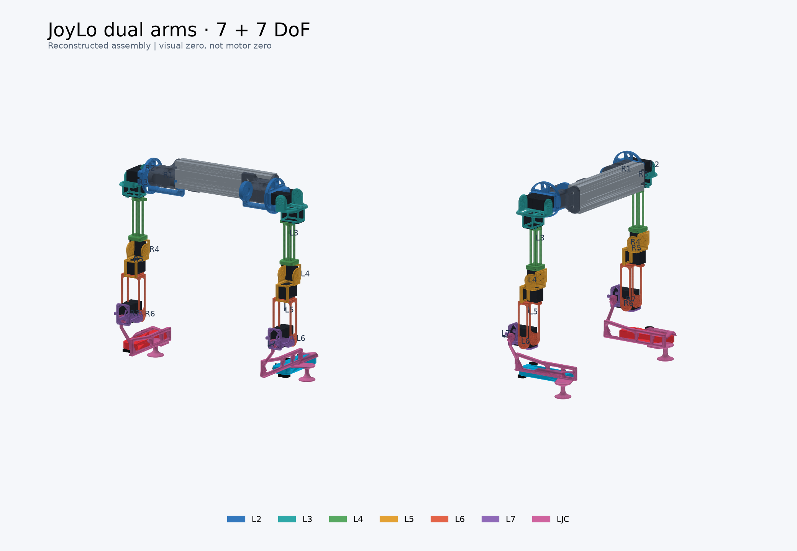

# 双臂 JoyLo：左臂原件 + 镜像右臂 + 2550 型材

默认入口：[joylo_dual.urdf](joylo_dual.urdf)，**14 个独立转动关节、27 个 link**。
根据用户对实物的判断，原始 JoyLo 是**左臂**；右臂由完整几何和运动学镜像得到。




## 使用

在仓库根目录：

```bash
~/miniconda3/bin/conda run --no-capture-output -n joylo-urdf python scripts/joylo/view_joylo_urdf.py
```

打开终端打印的本机地址，通常为 http://127.0.0.1:8080。

- **显示每台电机 ID**：默认显示 18 台电机的装配编号。按模型所示位置设置左臂 0–8、右臂 9–17。详见 [电机 ID 与零位依据](MOTOR_IDS_AND_ZERO.md)。
- **左臂 / 右臂**标签页：各 7 个滑块，分别联动 R1 Pro 对应侧；另一侧保持原位置。
- **左右镜像联动**：任意一侧的动作映射为另一侧的镜像动作。两侧的数值不一定同号。
- **恢复零位**：两臂所有滑块恢复 0°。
- **恢复标定位**：左臂 `[-90,90,-90,-90,90,60,90]`，右臂镜像为 `[-90,-90,90,-90,-90,60,-90]`。
- 鼠标旋转、滚轮缩放、右键拖动平移；可单独聚焦 JoyLo 或 R1 Pro。
- JoyLo ×2.5 仅为与 R1 Pro 同屏时看清零件，URDF 中的尺寸仍为真实比例。
- `--solo` 仅显示双臂 JoyLo；`--port 8081` 更换端口。

网格一次上传，拖动只更新关节旋转，更新合并到最多 60 Hz；不连接实体硬件。

单臂入口仍可用：

```bash
python scripts/joylo/view_joylo_urdf.py --urdf hardware/joylo_v2_7dof_arm/urdf/joylo_left.urdf --solo
python scripts/joylo/view_joylo_urdf.py --urdf hardware/joylo_v2_7dof_arm/urdf/joylo_right.urdf --solo
```

导出和检查：

```bash
python scripts/joylo/view_joylo_urdf.py --check
python scripts/joylo/view_joylo_urdf.py --save /tmp/dual_joylo.png
python -m unittest discover -s tests -p 'test_joylo*.py'
```

`--joints` 使用 **JoyLo 原生角度（度）**：传 7 个值时双臂都使用该组原生角；传 14 个值时为左臂 7 个、右臂 7 个。
按用户最新确认，两臂 J3 采用修改前网页 0° 的姿态作为零位和启动姿态。两侧网页初始角均为 0°（包括 J6、J7），初始原生角均为 `[0,0,0,0,0,90,0]`；共同零位对应 `[0,0,0,0,0,90,0]`。J3 原先的 90° 显示偏置已并入 URDF 安装变换，原生零角与网页零角一致。网页滑块采用下文的 R1 Pro 参考角，不能与 URDF 原生角度混用。
新机器可用 `conda env create -f hardware/joylo_v2_7dof_arm/urdf/environment.yml`。

## J6 前后法兰修正

已按原厂惰轮安装方式修正 J6/J7 电机槽的分工，并分别表示金色驱动法兰和蓝色背面惰轮。
网页可聚焦 J6、隐藏打印件查看内部。尺寸依据与尚未核对的配合公差见 [J6 装配说明](J6_ASSEMBLY.md)。

## Joy-Con 手柄

已加入原版 Switch 的左右 Joy-Con：左侧青色、右侧红色。左侧摇杆在上、方向键在下；右侧 ABXY 区在上、摇杆在下，并分别使用减号/加号、截图/Home 键。右侧不是简单复制左侧按键。

外形总包络为 102×35.9×28.4 mm，参考[任天堂官方规格](https://www.nintendo.com/ph/hardware/switch/modal/specs/joy-con.html?width=960)。外壳、按键、滑轨和扳机均为轻量近似，不是厂家 CAD。

手柄固定到 `ljc`，随 J7 运动，不增加自由度。摆放参考 LJC 原生背板 X=12.28 mm、滑轨槽 Y=5.1..7.6 mm、底部 Z=2 mm；模型宽度沿支架 Y、厚度沿 X、长度沿 Z。可用“显示 Joy-Con 手柄”开关检查支架。配合公差及实际安装仍需核对。

J6/J7 初始姿态以用户提供的[官方视频](https://behavior-robot-suite.github.io/docs/sections/joylo/joylo_7dof.html)截图为依据；第二张双臂图片只作为手柄外观参考，没有把其中旧版臂的尺寸或姿态直接套到当前七轴模型。

## 文件

| 文件 | 内容 |
|---|---|
| `joylo_dual.urdf` | 双臂 + 型材总装；默认入口 |
| `joylo_left.urdf` | 原始左臂，7 自由度 |
| `joylo_right.urdf` | 真正镜像的右臂，7 自由度 |
| `joylo_v2_7dof.urdf` | 左臂源装配；保留原文件路径 |
| `mirrored/*.obj` | 右臂打印件及法兰示意网格，来自左臂模型的镜像 |
| `support/joycon_shell.obj` | Joy-Con 轻量壳体；按键在 URDF 中单独定义 |
| `support/extrusion_2550_200mm.obj` | 25×50×200 mm 简化六槽型材 |
| `joint_limits_and_mapping.json` | 双臂限位、符号及展示偏置 |
| `SINGLE_ARM_NOTES.md` | 历史单臂几何推导，不作为当前左右手性/入口说明 |

移动 URDF 时需要保留其上一级原始 OBJ、`mirrored/` 和 `support/`。
未改动原始打印 OBJ；镜像文件不使用负缩放，便于其他 URDF 查看器加载。

## 镜像与安装关系

镜像面为模型的 **XZ 平面**（Y 为左右方向）：

```text
S = diag(1, -1, 1)
p_right = S p_left
R_right = S R_left S
revolute_axis_right = -S revolute_axis_left
```

同时反转 OBJ 的三角面/多边形顶点顺序，修正法向量。因此右臂不是复制一份左臂再旋转。
同一组原生角度下，左右臂在任意姿态都互为几何镜像；关节名分别为 `left_joint_1..7`、`right_joint_1..7`。

### 2550 × 200 mm 型材

找到了 [80/20 25-2550 六槽型材规格](https://8020.net/25-2550.html)及其 [CAD 目录条目](https://www.3dcontentcentral.com/download-model.aspx?catalogid=174&id=31796&partnumber=25-2550+X+4876.8)。
没有取得可直接使用的厂家 CAD 文件；当前模型是按用户指定外形尺寸生成的**简化示意件**，不是厂家精确断面。

- 外形：X=25 mm，Y=200 mm，Z=50 mm；按一根横梁布置。
- 六条开放 T 槽为示意几何：槽口约 6 mm、槽腔约 10 mm；未建中心孔、螺纹、螺钉和 T 型螺母。
- 型材中心位于 `(-34.827, 0, 0) mm`，对齐原支架安装区域。
- 型材端面在 Y=±100 mm；原支架外侧安装板厚 5 mm，因此左右基座原点分别为 Y=±105 mm，间距 210 mm。
- 原支架带有 25.4/50.8 mm 和约 25.4 mm 孔距特征，与公制 25/50 mm 略不同。这里仅检查安装面贴合，**不代表孔位、T 型螺母或英制/公制规格已经兼容**。
- [官方旧版安装照片](https://behavior-robot-suite.github.io/docs/sections/joylo/step_by_step_assembly_guidance.html#put-everything-on-the-t-slot-extrusion)展示型材连接方法，但该支撑架布置不等同于当前单根 200 mm 横梁方案。

重新生成（在 conda 环境中）：

```bash
python scripts/joylo/build_dual_joylo.py --length 0.20
```

它会从左臂源装配生成左右单臂、右臂镜像网格、型材和双臂总装。改变长度会同步改变横梁长度及两侧安装板位置。

## 双臂与 R1 Pro 联动

采用 `assets/robot/r1_pro_a2_2026` 的官方 **R1 Pro 2026 / A2** 七轴模型，出处与提交号见该目录 README。
原项目 `assets/robot/r1_pro` 是每臂六关节的旧资产，未覆盖，也未作为双臂联动模型。

网页共同角度采用各侧 R1 Pro 原生角度，换算到 JoyLo：

```text
偏置 = [0, 0, 0, 0, 0, 90, 0] 度
左臂原生角 = 偏置 + [1,  1, -1, 1, -1, 1,  1] × 左侧共同角
右臂原生角 = 偏置 + [1, -1,  1, 1,  1, 1, -1] × 右侧共同角
```

镜像联动时：`右侧共同角 = [L1, -L2, -L3, L4, -L5, L6, -L7]`。
展示对齐后的对应正向轴点积 >0.999；这些符号和偏置**不是实体电机的编码器校准**。

| 关节 | 左侧共同范围（度，约） | 右侧共同范围（度，约） |
|---|---|---|
| J1 | -253 ~ 73 | -253 ~ 73 |
| J2 | -8 ~ 178 | -178 ~ 8 |
| J3 | -133 ~ 133 | -133 ~ 133 |
| J4 | -118 ~ 18 | -118 ~ 18 |
| J5 | -133 ~ 133 | -133 ~ 133 |
| J6 | -58 ~ 58 | -58 ~ 58 |
| J7 | -75 ~ 75 | -75 ~ 75 |

除 J7 额外收窄外，范围源于官方 A2 URDF。JoyLo 的原生预览范围由上述映射换算，两侧相同。
**JoyLo 真实机械限位仍未校准，范围也不是碰撞约束。** 重建模型在肩部和部分腕部配合处仍有基准几何相交；J7 曾做局部修正和扫描，不等于所有双臂组合姿态都无干涉。
没有质量、惯性或碰撞控制配置，不能直接用于动力学仿真或硬件控制。

## 验证

- URDF 加载、14 自由度树结构、上下游运动一致性。
- 多个姿态下左右 link 变换严格镜像；镜像 OBJ 顶点与原件对应，面片绕序保持体积符号。
- 逐关节检查左右命令独立，并分别映射到 R1 Pro 同侧关节。
- 两侧限位及镜像角度映射相容。
- 型材网格闭合，外包围尺寸为 25×200×50 mm；安装板端面位置相符。

## J3–J4 输出端装配修正

按装配截图对绿色 l4 连杆与 ID 5 电机增加绕 J3 局部 +Y 的 90° 安装旋转，并同步 J4 安装坐标，右臂镜像更新。J3 的 origin、axis 与初始角度保持原值。修正在 l4 的 visual origin 和 joint_4 的 origin 中，不是电机编码器零位标定。下游相对上游的空间朝向随此次安装修正改变，R1 仍按原有角度映射联动。

青色 l3 支架朝向修正：支架及内部 J3 电机绕局部 Z 输出轴翻转 180°，突出部分改向外侧；J2/J3 关节 origin、axis、初始角及下游安装相位保留。两侧 J2 共轴安装面互换，J3 输出轴位置不变。


J4 电机单独安装修正：撤销绕输出轴的修改，恢复壳体中心；ID 5 绕初始姿态的世界竖直轴、以壳体中心为支点旋转 +90°，ID 14 镜像同步。只改变电机 visual 方向，绿色连杆、关节及下游组件保持不变。

J4 转轴最终修正：参考初始姿态下由身体前后 X 方向改为身体左右 Y 方向。电机当前朝向保留，修正 joint_4 安装旋转，使实际运动轴与电机输出轴一致；下游支架随输出坐标旋转，绿色 l4 不变。左右臂同步镜像。

用户指定范围：J6/J7 均为 [-90°,90°]，左 J2 下限 -90°、右 J2 上限 90°。R1 模型保留官方限位，超出其范围的联动角度会截断。恢复标定位采用网页关节角，不是编码器 ticks。
