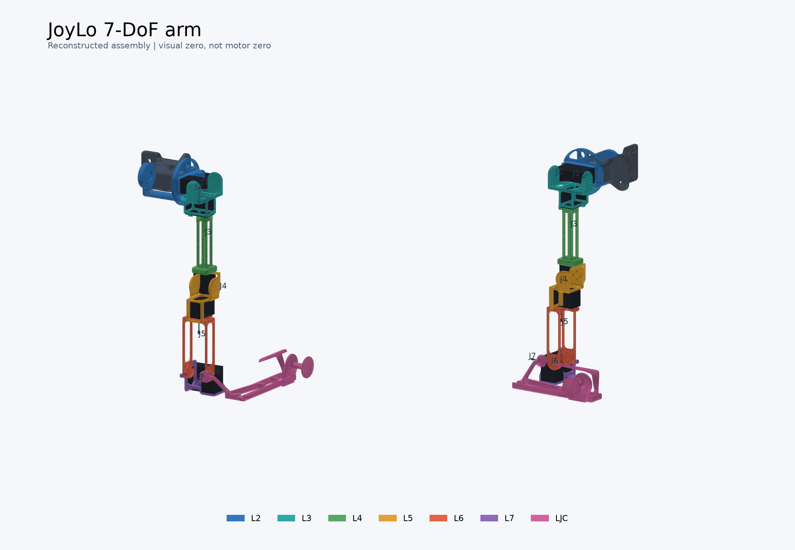

> 历史单臂推导记录。当前左右手性、默认入口、双臂映射和型材布置以 README.md 为准。

# JoyLo V2 7-DoF 可视化 URDF

入口：[`joylo_v2_7dof.urdf`](joylo_v2_7dof.urdf)。

这是依据本仓库 OBJ、官方新版装配视频和 XL330 外形尺寸重建的**可视化装配草稿**，不是作者提供的总装 CAD，也未经过实物尺寸或电机零位校准。适合查看零件层级、安装朝向和关节运动；不能据此确认机械干涉、螺钉长度、装配公差或向电机下发角度。



## 打开模型

本机已创建 `joylo-urdf` conda 环境。在仓库根目录运行：

```bash
conda activate joylo-urdf
python scripts/joylo/view_joylo_urdf.py
```

如果当前终端尚未初始化 conda，本机也可以直接运行：

```bash
~/miniconda3/bin/conda run --no-capture-output -n joylo-urdf python scripts/joylo/view_joylo_urdf.py
```

默认交互查看器使用 **Viser / 浏览器 WebGL**，同屏显示 JoyLo 和官方七自由度 **R1 Pro 2026 / A2**。启动后打开终端显示的本机网址，通常为 **http://127.0.0.1:8080**；终端中的进程需要保持运行，Ctrl+C 停止。端口占用时以终端实际打印的网址为准，也可传入 `--port 8081`。仅显示 JoyLo 可加 `--solo`。

支持鼠标旋转、滚轮缩放、右键拖动平移、7 个共同角度滑块、复位、显示/隐藏电机占位件及坐标轴。拖动 Jn 同时改变 JoyLo Jn 与 R1 Pro **右臂** Jn，左臂、躯干和底盘保持不动。可以同屏取景或分别聚焦模型。JoyLo 放大 2.5 倍仅为便于比较，不改变角度映射。它不连接电机、JoyCon 或机器人。

完整网格只上传一次，随后浏览器保持连杆父子层级；拖动时只更新发生变化的关节四元数。滑块事件合并为最多每秒 60 次姿态更新，避免积压。**这不是对实际帧率的保证**，浏览器硬件加速和显示设备仍会影响体验。

本机 conda 环境已补充 Viser。已有旧环境的其他机器可运行：

```bash
conda install -n joylo-urdf -c conda-forge viser=0.2.23
```

旧版桌面窗口仍可使用 `--backend matplotlib` 启动，`--save` 继续使用 Matplotlib 导出图片。

仅验证，或导出图片：

```bash
python scripts/joylo/view_joylo_urdf.py --check
python scripts/joylo/view_joylo_urdf.py --save /tmp/joylo.png
python scripts/joylo/view_joylo_urdf.py --joints -20 -20 100 -30 10 100 15 --save /tmp/joylo_bent.png
```

在另一台机器上重建环境：

```bash
conda env create -f hardware/joylo_v2_7dof_arm/urdf/environment.yml
```

也可以用支持 OBJ 的 URDF 查看器打开此文件。网格路径是相对于 URDF 的 `../l2.obj` 等；移动模型时需要保留上一级 OBJ 文件。原始 OBJ 中引用的 MTL 未在仓库提供，颜色由 URDF 指定；配套查看器直接读取 URDF 颜色。

## 包含什么

- 10 个 link，7 个 revolute joint，2 个 fixed joint。
- 10 个原始打印件：`mount`、`mountback`、`l2back`、`l2` 至 `l7`、`ljc`，没有修改或重新导出这些 OBJ。
- 9 个深灰色电机壳体占位盒及简化轴盘。它们用于说明装配间距，不是 ROBOTIS 的精确 CAD。
- 不包含 `u2d2_mount.obj`：这是装在型材上的独立附件，其相对于单臂的位置没有可靠依据。
- 不包含型材、JoyCon 电子手柄、线缆、螺钉和螺母。
- 无惯性、质量、碰撞体、传动或控制配置。关节范围已依据官方 A2 限位与展示零位换算，属于 JoyLo **预览推定范围**；effort=1、velocity=1 仍是占位参数，不能当作机械/电气额定值。

## 七关节映射与限位

本地 `assets/robot/r1_pro/r1_pro.urdf` 每条手臂只有六个关节，对应原 BRS 六自由度模型。
官方 R1 Pro 则使用七自由度 A2，新增模型存放在 `assets/robot/r1_pro_a2_2026`，来源和提交号见其 README。

共同滑块采用 **R1 Pro 右臂原生 URDF 角度**。JoyLo 重建模型与 A2 的零位、轴向不同，转换是：

```text
JoyLo 原生角度 = [0, 0, 90, 0, 0, 90, 0] + [1, 1, -1, 1, -1, 1, 1] × 共同角度
R1 Pro 右臂角度 = 共同角度
```

这样在共同零位，七组正向关节轴基本同向（点积 >0.999），不需要 7→6 的 IK 转换。
这是根据模型几何得出的**展示对齐**，没有校准实体 Dynamixel 的编码器。
现在的默认 JoyLo 原生角度为 `[0,0,90,0,0,90,0]`，共同滑块为全零。
`--joints` 和旧版 Matplotlib 控件继续使用 JoyLo 原生角度；网页会单独显示其数值。

| 关节 | 官方 R1 Pro 2026 右臂范围（度，约） | 共同滑块范围（度，约） | JoyLo 原生预览范围（度，约） |
|---|---|---|---|
| J1 | -253 ~ 73 | -253 ~ 73 | -253 ~ 73 |
| J2 | -178 ~ 8 | -178 ~ 8 | -178 ~ 8 |
| J3 | -133 ~ 133 | -133 ~ 133 | -43 ~ 223 |
| J4 | -118 ~ 18 | -118 ~ 18 | -118 ~ 18 |
| J5 | -133 ~ 133 | -133 ~ 133 | -133 ~ 133 |
| J6 | -58 ~ 58 | -58 ~ 58 | 32 ~ 148 |
| J7 | -88 ~ 88 | -75 ~ 75 | -75 ~ 75 |

J7 的较小范围为 JoyLo 预览留有余量；其余范围是 A2 限位在展示对齐下的换算，**并不是测得的 JoyLo 机械限位**。
额外的几何扫描发现重建模型在肩部及部分腕部配合处仍有基准相交，所以不能由这份模型推导整臂真实的无碰撞范围。
各关节独立满足范围，也不代表组合姿态无碰撞。
精确数值、来源和映射保存在 [`joint_limits_and_mapping.json`](joint_limits_and_mapping.json)。

## 装配树

```text
base_link (mount + motor)
├── mountback [fixed, includes rear motor]
└── J1 → l2 (two motors)
    ├── l2back [fixed coupling rod]
    └── J2 → l3 (motor)
        └── J3 → l4 (motor)
            └── J4 → l5 (motor)
                └── J5 → l6
                    └── J6 → l7 (two orthogonal motors)
                        └── J7 → ljc
```

肩部两组双电机分别共轴，所以每组只贡献一个运动自由度。`l2back` 跟随 `l2` 刚性运动；没有在 URDF 中重复建立闭环。`ljc.obj` 经焊接同位置顶点后检查，主体为相连结构，偏置轴盘与手柄支架通过细连接臂相连，因此完整保留。

## 坐标和可核对的参数

URDF 长度单位为米、角度为弧度。OBJ 按毫米解释，统一使用 `scale="0.001 0.001 0.001"`；这个单位判断与电机安装腔尺寸相符。`base_link` 使用原始 `mount.obj` 坐标。除固定支架外，各 link 保持其 OBJ 的轴方向，但把原点平移到本级关节轴上。

下表为**原始 OBJ 坐标，单位毫米**，不是直接复制到 URDF 的米制 `origin`。安装面的数值是从网格获得的，电机轴相对壳体的偏移和装配角度则是重建假设。三位小数来自 CAD 网格，不代表装配精度。

| 关节 | 父零件中的轴位置 | 子零件中的对齐参考 | 子坐标轴 |
|---|---|---|---|
| J1 | mount `(7.5, 26, 0)` | l2 `(0, 0, 7.5)` | Z |
| J2 | l2 `(0, 0, 36.5)` | l3 `(0, -23.1, 0)`，两侧孔圆共轴 | Y |
| J3 | l3 `(0, -23.1, 45.508)` | l4 `(0, 2.4, 0)` | Y |
| J4 | l4 `(0, 99, 0)` | l5 `(0, 43, 0)`，两侧孔圆共轴 | X |
| J5 | l5 `(0, 0.115, 15)` | l6 `(0, 2.4, 0)` | Y |
| J6 | l6 `(0, 76, 0)` | l7 `(-11.627, 27.5, 0)`，电机中面 | X |
| J7 | l7 `(10, 27.5, 14.4)` | ljc `(-50, 25.2, 125.307)`，外侧安装面 | Z |

具体旋转见 URDF 的各 joint `origin rpy`。旧的原生全零姿态是重建时的下垂参考；当前网页的共同零位使用上文的展示对齐。两者都**不是官方电机零位，也不保证与视频某一帧的关节角相同**。没有映射左右臂电机 ID 或校准编码器方向。

### 已有依据

- 新版视频显示的零件连接顺序与双电机/单电机分布。
- l3 的两侧安装面 `y=2.9/-49.1`，轴心间距 52 mm；l5 的孔圆中心 `y=43`，l6 的孔圆中心 `y=76`。
- l3 电机安装面 `z=19.508`、l4 电机端部安装面 `y=74.5`、l5 电机背面安装面 `y=26.115`。
- 两底座背面在 `y=-5` 相接；采用 62 mm 的两侧电机轴盘面间距时，耦合杆可以穿入 l2 对应孔并在板端附近结束。其接触深度仍需实物核对。

### 优先待核对

1. **电机壳体与轴盘**：官方总尺寸为 20×34×26 mm；本模型把壳体近似为 20×34×23 mm，并为轴盘留约 3 mm，轴沿长边距中心 7.5 mm。这一分解与支架相容，但未由官方尺寸图逐项确认。
2. **J3/J5 轴盘深度**：需要实际电机、轴盘和凹槽厚度来确定。目前由上述壳体假设及网格安装面推算。
3. **J6/J7 的装配角和轴盘朝向**：依据视频和网格重建。J7 已修正为正 Z 一侧的输出面，使用 ljc 的外侧安装面，解决了原先零位穿插；仍应对照实物核实电机输出侧及安装角。
4. **左右手性、零位、限位与干涉**：未校准。此模型保留目录中的未镜像网格；需要对照你要组装的那一侧实物确认安装方向。

修改关节位置时改对应 joint 的 `origin`；修改某个 OBJ 相对关节的位置时改该 link 下 visual 的 `origin`。灰色电机盒需要同步调整。不要通过改 OBJ 顶点来弥补装配参数误差。

### J7 初始姿态干涉修正

原版把 J7 放在电机负 Z 面，同时以 `ljc` 内部 `z=127.307 mm` 为基准，导致全零姿态下手柄支架与腕部相交。现改为电机正 Z 面和手柄外侧 `z=125.307 mm` 安装面；没有修改原始网格或通过限位隐藏问题。

用 FCL 0.7.0 对原始三角网格检测，原版零位 `ljc` 与 `l6`、`l7`、J7 电机占位盒均有表面交叠，修正后未检出这些交叠。修正后的安装盘位于 l7 坐标 Z=14.4 至 21.4 mm，电机占位盒上表面为 Z=11.5 mm；轴盘填充其间的装配间隙。

固定原生 J1–J6=0，对 J7 从 -180° 到 180° 每 1° 扫描 `ljc` 与其他打印件及电机占位盒（不含同 link 的轴盘、配合轴盘）的三角面交叠：**[-80°, 80°] 的采样点未检出交叠**；约 -176° 至 -81°、81° 至 141° 的采样点仍有腕部碰撞。这不是认证的机械限位，也不意味着其他 J6 角度或更细采样都安全。本轮联动预览把 J7 收窄到 ±75°，仍不作为无碰撞保证。

## 验证范围

配套脚本用 yourdfpy 验证 URDF、载入所有视觉几何，并逐一改变 7 个关节，检查下游 link 跟随、上游 link 不动及本级旋转中心不漂移。预览由该 URDF 直接计算生成，而非另画的示意图。这些检查保证文件结构和运动树可用，不证明实物装配尺寸或碰撞正确。

GPU 查看器的运动学回归测试：

```bash
python -m unittest discover -s tests -p test_joylo_web_viewer.py
```

该测试把浏览器节点层级在多个关节姿态下的变换与 yourdfpy 比较，并检查更新期间未改变或再次上传网格。Viser 0.2.23 的 macOS 启动进程扫描竞态在启动函数中做了兼容处理；保留其默认分享按钮以避开该版本隐藏按钮时的 React 问题，程序本身没有创建公开分享链接。

## 来源

- 本仓库 `hardware/joylo_v2_7dof_arm/*.obj` 与 F3D 内嵌预览。
- [官方 7-DoF 页面](https://behavior-robot-suite.github.io/docs/sections/joylo/joylo_7dof.html)。
- [新版装配视频](https://behavior-robot-suite.github.io/docs/_images/joylo_7dof_assemply.mp4)，检查肩部、中段和腕部组装画面。
- [官方 JoyLo BoM](https://behavior-robot-suite.github.io/docs/sections/joylo/overview.html)：XL330-M288-T 型号；旧版数量没有直接套用到新版。
- [ROBOTIS XL330 规格](https://emanual.robotis.com/docs/en/dxl/x/xl330-m288/)及[轴盘/惰轮安装图](https://emanual.robotis.com/assets/images/dxl/x/x330/xl330_assembly_integrated.png)。
